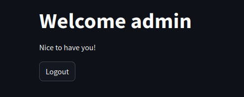

# INTERNSHIP - SEM IV
A compilation of my fourth semester internship programs/projects  

## Internship Provider:

</img>

**Start date:** 07-Apr-2025  
**Location:** Hyderabad

## Week 1:
**Duration :** 07/04/2025 - 11/04/2025  
The first week focuses mainly on learning fundamentals to use in projects, learning various frameworks available as well as how to use them. This week helps build on the projects that is to come in the upcoming weeks.
  ### Day 1: 
  Learnt basics of HTML and CSS to ensure familiarity with HTML/CSS code in future web-scraping projects. Constructed a [resume](https://github.com/Haniel-Samson/internship-sem-iv/blob/main/Week-1/Intro-to-HTML/Sample.html) using HTML and [styled](https://github.com/Haniel-Samson/internship-sem-iv/blob/main/Week-1/Intro-to-HTML/style.css) it using CSS.

</img>

  ### Day 2: 
  Utilization of Bootstrap framework to introduce concept of frameworks. Re-did [resume](https://github.com/Haniel-Samson/internship-sem-iv/blob/main/Week-1/Intro-to-HTML/BootstrapSample.html) using bootstrap components. Researched on beautifulsoup, selenium and the requests library for future webscraping projects.
  ### Day 3: 
  Introduction to Streamlit, an open source python framework for developing fast web-applications. Constructed a [Login Page](https://github.com/Haniel-Samson/internship-sem-iv/blob/main/Week-1/Streamlit/Login.py) via session_states and a [Chatbot](https://github.com/Haniel-Samson/internship-sem-iv/blob/main/Week-1/Streamlit/Chatbot.py) using AIMLAPI. Obtaining of free aimlapi key to set up functional chatbot.

**Login Page:**

<table>
  <tr>
    <td></td>
    <td></td>
    <td></td>
  </tr>
 </table>
 
**Chatbot:**

  </img>

  ### Day 4: 
  Studies on Streamlit continued. [Login Page](https://github.com/Haniel-Samson/internship-sem-iv/blob/main/Week-1/Streamlit/Login2.py) re-made using pages and navigation components in streamlit. Started mini-project on a [Web Scraping Tool](https://github.com/Haniel-Samson/internship-sem-iv/blob/main/Week-1/Streamlit/Datascaper.py) to download all images, text, tables in a given wikipedia page. Images to be stored in their respective formats, Tables to be stored in csv format, Text to be stored in text format. Utilized several packages such as beautifulsoup, requests library, os and csv to utilize scraping, automated html gathering, file directory storage and csv writer respectively. 

  </img>
  </img>

  
  ### Day 5: 
  Introduction to github and its various components. Uploading of all associated project files to github. Research on opencv and associated packages for an upcoming miniproject.

## Week 2:
**Duration :** 14/04/2025 - 18/04/2025  
The second week introduces us to OpenCV in Python and working with OpenCV to create a ROI.  
 
Packages Used:  
opencv: For image display and to act as a canvas to select ROI.  
numpy: To store the coordinates of points selected in a numpy array.  
 
Functions Used:  
updatepoints(x,y): To update coordinates of points to enable drag functionality of the whole region that is selected.  
updatepoint(x,y): To update coordinate of a single point to enable drag functionality of a single point selected.  
movepoint(event,x,y,...): To ensure that a point is draggable when clicked within a specified region of the point and stops being draggable when the mouse button is released. Also ensures right clicking to delete a point, middle mouse click to add a point with respect to the first point and double left click to clear all points.  
draw_image(): To plot image and its associated points.  
dispCoords(): To store the coordinates of the points into a text file.  
ROIView(point_coords): To open a new window for the specified ROI.  
plotpoints(event,x,y,...): To ensure that points are plotted based on mouse left click and lines are connected when two or more points are present on the screen. Shades the selected region when the first point is clicked again and opens the ROI in a new window by ccalling the ROIView function.  
 
Purpose:  
ROI or Region of Interest are specific portions of an image that are selected, usually for processing images by ML algorithms. Here we implement the features to add points, remove points based on GUI input or to select points entered in the CLI. For GUI input, the points are enclosed by selecting the first point which closes the polygon and shades the selected region.  

## Week 3:
**Duration :** 21/04/2025 - 25/04/2025  
Visualization of datasets in javascript and HTML.  
